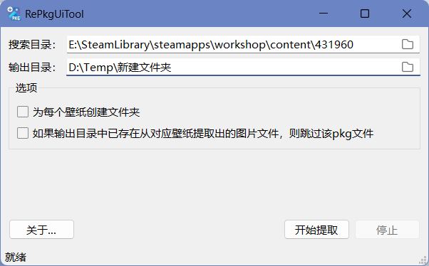

# RePkgUiTool
这是一个RePKG的图形界面工具。

它可以自动扫描Wallpaper Engine中的所有pkg文件，调用RePKG.exe解包pkg文件，并将解包出来的图片文件复制到指定目录下。

程序调用的RePKG来自以下项目：

[notscuffed/repkg: Wallpaper engine PKG extractor/TEX to image converter (github.com)](https://github.com/notscuffed/repkg)

